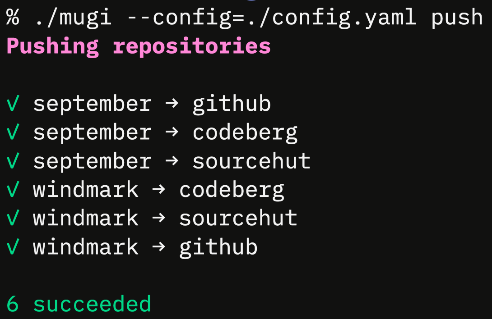

# Mugi

> Personal **Mu**lti-**Gi**t Remote Manager

Mugi keeps your repositories in sync across multiple Git remotes (GitHub, Codeberg, SourceHut, etc.)
with a single command.

Mugi is written in [Go](https://go.dev) and uses [Bubble Tea](https://github.com/charmbracelet/bubbletea)
for its terminal interface.

## Usage

```bash
mugi pull                      # Pull all repos from all remotes
mugi pull windmark             # Pull Windmark from all remotes
mugi push windmark gh cb       # Push Windmark to GitHub and Codeberg
mugi fetch gemrest/september   # Fetch specific repository
```

<br>
<p align="center"></p>

### Installation

```bash
go install github.com/Fuwn/mugi/cmd/mugi@main
```

or

```bash
git clone https://github.com/Fuwn/mugi.git
cd mugi
go build -o mugi ./cmd/mugi
mv mugi ~/.local/bin/  # or anywhere in your PATH
```

### Configuration

Mugi uses a YAML config file at `~/.config/mugi/config.yaml`:

```yaml
remotes:
  github:
    aliases: [gh]
    url: git@github.com:${user}/${repo}.git
  codeberg:
    aliases: [cb]
    url: git@codeberg.org:${user}/${repo}.git
  sourcehut:
    aliases: [sh]
    url: git@git.sr.ht:~fuwn/${repo}

defaults:
  remotes: [github, codeberg, sourcehut]
  path_prefix: ~/Developer

repos:
  gemrest/windmark:
  gemrest/september:
```

### `--help`

```
Mugi - Personal Multi-Git Remote Manager

Usage:
  mugi [flags] <command> [repo] [remotes...]

Commands:
  pull    Pull from remote(s)
  push    Push to remote(s)
  fetch   Fetch from remote(s)
  help    Show this help
  version Show version

Flags:
  -c, --config <path>  Override config file path
  -V, --verbose        Show detailed output

Examples:
  mugi pull                      Pull all repositories from all remotes
  mugi pull windmark             Pull Windmark from all remotes
  mugi pull windmark github      Pull Windmark from GitHub only
  mugi push windmark gh cb       Push Windmark to GitHub and Codeberg
  mugi fetch gemrest/september   Fetch specific repository
  mugi -c ./test.yaml pull       Use custom config
```

## Licence

Licensed under either of [Apache License, Version 2.0](LICENSE-APACHE) or
[MIT license](LICENSE-MIT) at your option.

Unless you explicitly state otherwise, any contribution intentionally submitted
for inclusion in this crate by you, as defined in the Apache-2.0 license, shall
be dual licensed as above, without any additional terms or conditions.
